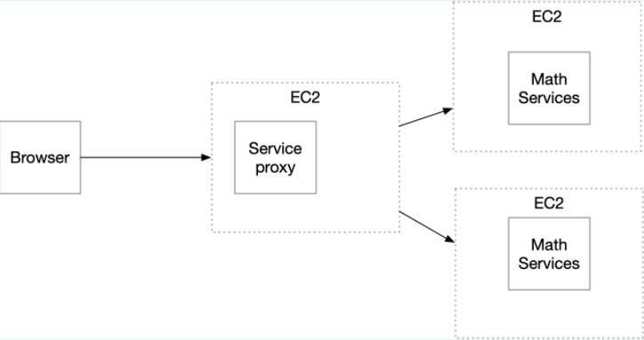
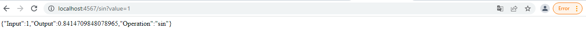
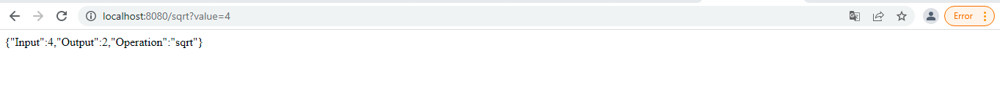
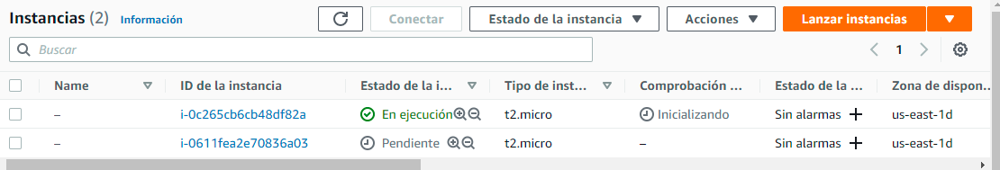
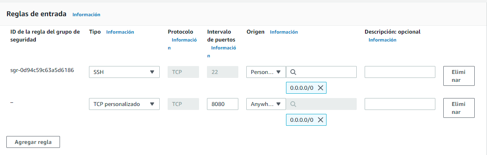
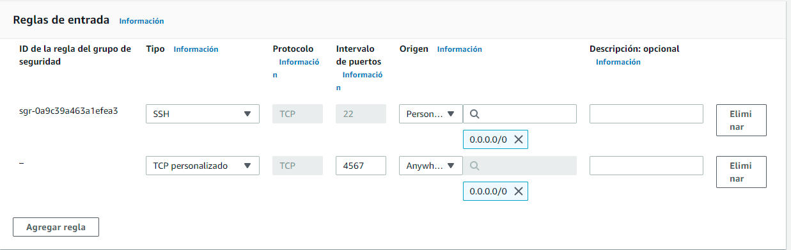
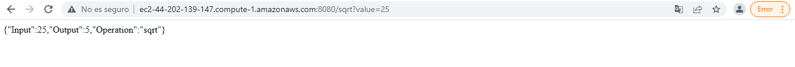
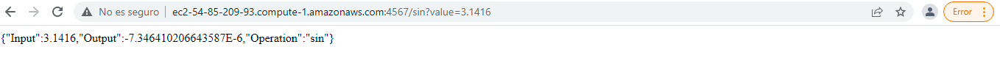

# ParcialAREP2

Diseñe un prototipo de calculadora de microservicios que tenga un servicios de matemáticas con al menos dos funciones implementadas y desplegadas en al menos 
dos instancias virtuales de EC2.



## Localmente

Funciones a implementar por numero de cedula
1. sin 
2. sqrt

El servidor que hace funcion de sin funciona bajo el puerto 4567


El servidor que hace funcion de sqrt corre bajo el puerto 8080



## Instancias virtuales de EC2

Creamos dos instancias EC2 en aws para alojar nuestros servicios en maquinas virtuales de amazon web services descargamos nuestros pares de claves para poder crear una conexion ssh a ambas maquinas



nos conectamos por sftp para enviar nuestro servicio java a la instancia virtual EC2

```
sftp -i "serviciosin.pem" ec2-user@ec2-44-202-139-147.compute-1.amazonaws.com
```

Ingresamos nuestro java ya compilado y lo corremos en nuestras instancias virtuales EC2

```
java -cp "target/classes:target/dependency/*" edu.escuelaing.edu.co

```

Abrimos los puertos correspondientes en nuestras instancias EC2 


El puerto 8080 para nuestro servicio de "sqrt"


El puerto 4567 para nuestro servicio de "sin"



Comprobamos su funcionamiento




Corriendo en dos instancias distintas en dos puertos distintos 
